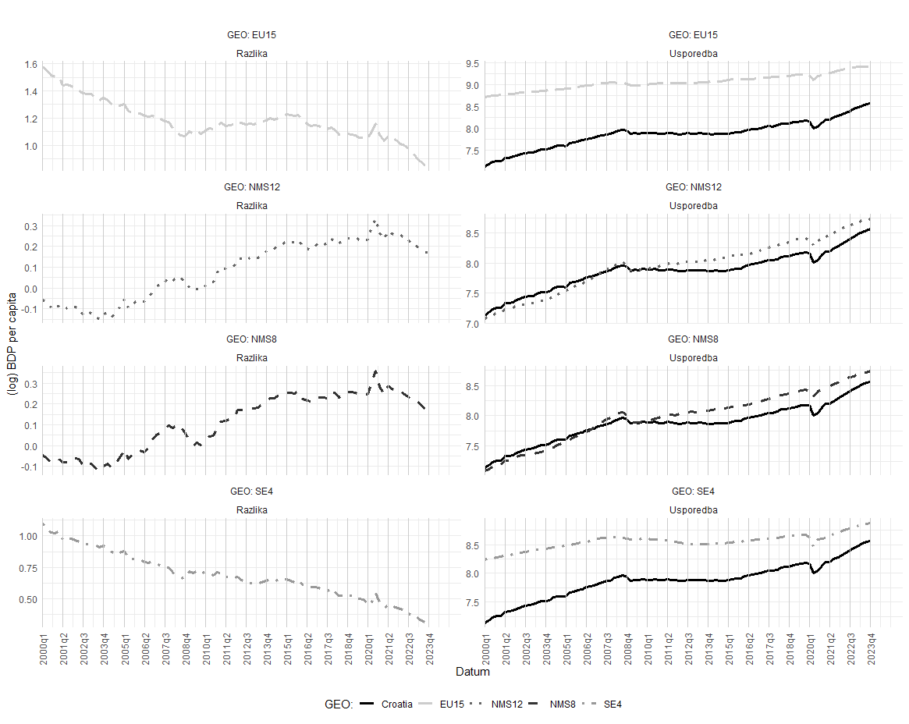

<p align="center">

</p>


# OpenSource and Reproducible Analysis of Economic Convergence Clubs for Croatia



## Overview

This repository contains the resources and data for the research paper titled **"OpenSource and Reproducible Analysis of Economic Convergence Clubs for Croatia."** The study investigates the income convergence of Croatia from 2000 to 2024 across four groups of countries: EU15, NMS8, NMS12, and SE4. Utilizing time-series methodology—specifically, fractional integration—the empirical analysis examines Croatia's membership in different economic convergence clubs within the European Union.

## Key Findings

- **Convergence with EU15 and SE4:**
  - **EU15:** Croatia demonstrates income convergence with EU15 countries, indicated by significant fractional integration parameters (\(d\)) ranging from 0.5643\*\*\* to 0.8986\*\*\*. These values suggest a mean-reverting process, albeit at a slow pace.
  - **SE4:** A similar pattern is observed with SE4 countries. Estimated \(d\) values between 0.8852\*\*\* and 0.9516\*\*\* suggest gradually diminishing income differentials over time.

- **Lack of Convergence with NMS8 and NMS12:**
  - **NMS8 & NMS12:** The analysis does not confirm convergence between Croatia and these country groups. Estimated \(d\) parameters exceed 1 (e.g., 1.4347\*\*\* to 1.5002\*\*\* for NMS8), indicating persistent income differentials and the absence of mean reversion.

- **Robustness:**
  - The results remain consistent across various estimators and bandwidth selections, highlighting stable and persistent income differences between Croatia and NMS8/NMS12, and confirming a slow but significant convergence with EU15 and SE4.

## Methodology

The study employs two primary tests to analyze convergence:

1. **ADF Test (Augmented Dickey-Fuller)**  
   - Examines different convergence concepts:
     - **Absolute Convergence** (no constant, no trend)
     - **Conditional Convergence** (constant included)
     - **Deterministic Trend Convergence** (constant and trend included)

2. **GPH Test (Geweke-Porter-Hudak)**  
   - Estimates the fractional integration parameter (\(d\)) across multiple bandwidths to determine the nature of convergence (stationary, mean-reverting, or non-stationary).

### ADF Test Results

| **Group Name**   | **Without Const/Trend** | **With Const** | **With Const/Trend** |
|------------------|-------------------------|----------------|----------------------|
| RH-NMS8          | -0.3342                 | -1.2816        | -1.2669              |
| RH-NMS12         | -0.2698                 | -1.0464        | -1.3638              |
| RH-SE4           | -4.1785\*\*\*           | -0.7209        | -2.6062\*            |
| RH-EU15          | -2.97\*\*               | -1.2619        | -1.9528              |

\*\*\* p < 0.01, \*\* p < 0.05, \* p < 0.1

### GPH Test Results

| **Group Name**     | **GPH \(d\) (0.4)**      | **GPH \(d\) (0.5)**      | **GPH \(d\) (0.6)**      | **GPH \(d\) (0.7)**      | **GPH \(d\) (0.8)**      | **GPH \(d\) (0.9)**      |
|--------------------|--------------------------|--------------------------|--------------------------|--------------------------|--------------------------|--------------------------|
| **Croatia vs NMS8**  | 1.4347\*\*\*            | 1.1921\*\*\*            | 1.286\*\*\*             | 1.1137\*\*\*            | 1.1511\*\*\*            | 1.1446\*\*\*            |
| **Croatia vs NMS12** | 1.5002\*\*\*            | 1.2523\*\*\*            | 1.2915\*\*\*            | 1.1047\*\*\*            | 1.1534\*\*\*            | 1.1048\*\*\*            |
| **Croatia vs SE4**   | 0.8852\*\*\*            | 0.8712\*\*\*            | 0.8867\*\*\*            | 0.9279\*\*\*            | 0.9272\*\*\*            | 0.9516\*\*\*            |
| **Croatia vs EU15**  | 0.5643\*\*\*            | 0.6541\*\*\*            | 0.7256\*\*\*            | 0.8405\*\*\*            | 0.8554\*\*\*            | 0.8986\*\*\*            |

\*\*\* p < 0.01

## Summary of Results

- **Absolute Convergence:**  
  - No convergence for NMS8 & NMS12; significant convergence for SE4 & EU15.

- **Conditional Convergence:**  
  - No evidence of conditional convergence with any group.

- **Deterministic Trend Convergence:**  
  - Weak convergence with SE4; no significant trend-based convergence for EU15, NMS8, or NMS12.

## Abstract

This paper analyzes the income convergence of Croatia from 2000 to 2024 with respect to four groups of countries: EU15, NMS8, NMS12, and SE4. By employing a time-series methodology based on fractional integration, we investigate Croatia’s membership in different convergence clubs within the European Union. The results show that Croatia converges toward the income levels of EU15 and SE4, with estimated fractional integration parameters of 0.87 and 0.95, indicating a slow but persistent convergence process. However, convergence with NMS8 and NMS12 is not confirmed, with parameters exceeding 1.0, suggesting lasting income differentials. These findings imply that Croatia is economically catching up with older EU member states and Southern European countries but not with newer member states.

## Conclusion

This study examined Croatia’s income convergence with various groups of EU member states by applying time-series analysis and fractional-integration methods. While previous literature indicated certain convergence patterns for some post-transition economies toward the EU average, this research focused specifically on Croatia’s convergence patterns. We also placed the question of income convergence in the broader context of European integration processes by analyzing Croatia’s mutual convergence with the average income of four groups: EU15, NMS8, NMS12, and SE4.

The fractional-integration tests on Croatia’s income differential with these groups show evidence of convergence only with EU15 and SE4, while no such convergence was found for NMS8 and NMS12. The results are robust to different estimators and bandwidth choices, indicating that Croatia converges slowly toward the average incomes of EU15 and SE4, with a slightly faster pace observed for SE4. The findings also reveal that Croatia is not part of the convergence club of new member states (NMS8 and NMS12) but belongs to the EU15 and SE4 clubs, where the convergence process with SE4 is more robust and faster than with EU15.

These insights have implications for European integration policies. Despite later accession to the EU and alignment with institutional, legal, and economic measures introduced by newer member states, Croatia does not display convergence with NMS8 and NMS12. This suggests that institutional and legal harmonization does not necessarily lead to economic convergence. Instead, Croatia appears to be converging more toward countries characterized by slower or negative economic growth (EU15, SE4). Verification of Croatia’s convergence to SE4 specifically highlights the need for policies to facilitate faster economic growth and development. Overall, the persistence of shocks, as indicated by the autocorrelation functions, underscores the suitability of fractional integration methods for capturing these convergence dynamics.

## Resources

- **Working Paper (HTML):** [Link](https://raw.githack.com/lusiki/Convergence/main/Paper.html)
- **Working Paper (Pdf):** [Link](./Paper/Konvergencija.pdf)
- **Working Paper (Rmd):** [Link](./Paper/Konvergencija.Rmd)
- **Working Paper (Latex):** [Link](./Paper/Konvergencija.tex)
- **Executive Summary:** [Link](https://raw.githack.com/lusiki/Convergence/main/Codes/Paper_executive.html)
- **Codes:** [Codes.R](.Codes/Codes.R)
- **Data:** Auto-generated from within the `Paper.Rmd` file.

## Reproduction

To reproduce the analysis, follow these steps:

1. **Clone the Repository:**
   ```bash
   git clone https://github.com/lusiki/Convergence.git
   cd Convergence
